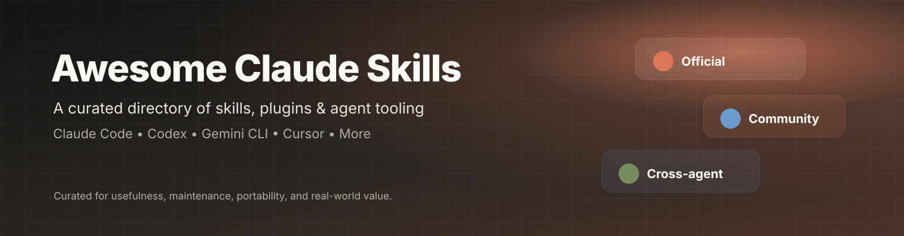

  

  
  
  
  

# Awesome Claude Skills

> A curated, human-maintained directory of high-value Skills, plugins, and agent tooling for **Claude, Claude Code, Codex, Gemini CLI, Cursor, and other Agent Skills-compatible environments**.

Skills are small, reusable instruction packages that give an AI agent specialized workflows, knowledge, scripts, references, and assets. The format is increasingly portable across coding agents, so this list favors projects that are useful beyond a single vendor where practical.

## Why this list exists

The ecosystem is growing faster than anyone should reasonably be expected to track. There are excellent skills everywhere, alongside a heroic amount of duplicated, abandoned, or barely tested markdown.

This list aims to be the useful bit.

### Curation standard

A project is favored when it has:

- **Real utility** for a recurring workflow.
- **Active maintenance** and a credible maintainer or organization.
- **Good implementation quality**, not just a flashy README.
- **Portability** across agents when the skill format supports it.
- **Clear installation and licensing information.**
- **Evidence of adoption, testing, or professional use** where available.

> **Safety note:** Third-party plugins can contain code, MCP servers, hooks, or other executable components. Read the source and review permissions before installing anything you do not trust.

---

## Official Skills

Anthropic maintains the reference implementation of Agent Skills and publishes a set of production-oriented and example skills. Its repository currently includes document-generation skills for PDF, DOCX, PPTX, and XLSX, plus creative and technical skills such as Canvas Design, Web Application Testing, MCP Builder, and Skill Creator.

### 📄 Document Skills

- **[PDF](https://github.com/anthropics/skills/tree/main/skills/pdf)** — Create, edit, extract, and analyze PDF documents using a structured workflow.
- **[DOCX](https://github.com/anthropics/skills/tree/main/skills/docx)** — Create and modify professional Word documents with controlled formatting and reusable document workflows.
- **[PPTX](https://github.com/anthropics/skills/tree/main/skills/pptx)** — Build and edit PowerPoint presentations with structured slide-generation and editing workflows.
- **[XLSX](https://github.com/anthropics/skills/tree/main/skills/xlsx)** — Create and analyze Excel workbooks with formulas, formatting, and spreadsheet-specific reasoning.

### 🎨 Design & Creative

- **[Canvas Design](https://github.com/anthropics/skills/tree/main/skills/canvas-design)** — Create original visual artwork and static designs as PNG or PDF artifacts.
- **[Algorithmic Art](https://github.com/anthropics/skills/tree/main/skills/algorithmic-art)** — Generate original p5.js-based algorithmic and generative art with seeded randomness and interactive parameters.
- **[Theme Factory](https://github.com/anthropics/skills/tree/main/skills/theme-factory)** — Apply curated typography and color systems consistently across decks, documents, reports, and web artifacts.
- **[Brand Guidelines](https://github.com/anthropics/skills/tree/main/skills/brand-guidelines)** — Apply Anthropic's official visual identity, colors, typography, and presentation styling to artifacts.

### 🧑‍💻 Development

- **[Web Application Testing](https://github.com/anthropics/skills/tree/main/skills/webapp-testing)** — Test local web applications with Playwright, including UI behavior, browser logs, screenshots, and debugging.
- **[MCP Builder](https://github.com/anthropics/skills/tree/main/skills/mcp-builder)** — Guide the design, implementation, and evaluation of high-quality MCP servers for external services.
- **[Skill Creator](https://github.com/anthropics/skills/tree/main/skills/skill-creator)** — Create, improve, evaluate, and benchmark Skills so they trigger reliably and perform well.
- **[Frontend Design](https://github.com/anthropics/claude-code/tree/main/plugins/frontend-design)** — Build distinctive, production-grade frontend interfaces instead of generic AI-looking pages.

### 🧩 Official Plugin & Reference Hubs

- **[Anthropic Agent Skills](https://github.com/anthropics/skills)** — The main Anthropic repository containing the reference skill implementations, Agent Skills specification, templates, and examples.
- **[Claude Code Plugins Official](https://github.com/anthropics/claude-plugins-official)** — Anthropic's managed directory of high-quality Claude Code plugins, including internal plugins and vetted external plugins.
- **[Claude Code Plugin Development](https://github.com/anthropics/claude-code/tree/main/plugins/plugin-dev)** — Official skills and tooling for building, reviewing, and packaging Claude Code plugins.

---

## Community Skills

Community projects are where the ecosystem gets interesting, because people inevitably automate the oddly specific workflows that official documentation politely ignores.

### 🧑‍💻 Development & Engineering

- **[Superpowers](https://github.com/obra/superpowers)** — A mature agentic development framework combining skills for TDD, debugging, planning, code review, worktrees, and multi-agent workflows across Claude Code, Codex, Cursor, Gemini CLI, and other agents.
- **[Trail of Bits Skills](https://github.com/trailofbits/skills)** — Security-focused skills for vulnerability research, smart-contract auditing, testing, and defensive engineering with Claude Code and Codex support.
- **[Trail of Bits Curated Skills](https://github.com/trailofbits/skills-curated)** — A security-conscious marketplace of Claude Code plugins that have been reviewed and approved by Trail of Bits.
- **[Frontend Design](https://github.com/Ilm-Alan/frontend-design)** — A cross-agent frontend-design skill for Claude Code, Codex, and Gemini CLI that provides explicit aesthetic systems for building polished interfaces.

### 📚 Research, Knowledge & Context

- **[Skill Seekers](https://github.com/yusufkaraaslan/Skill_Seekers)** — Turn documentation sites, GitHub repositories, PDFs, videos, notebooks, and other sources into structured AI-ready Skills and knowledge assets.
- **[Notion Skills](https://github.com/brianlovin/notion-skills)** — Store, collaborate on, publish, and synchronize Agent Skills from a shared Notion database across Claude, Codex, Cursor, Gemini, and other agents.
- **[Notion Claude Code Plugin](https://github.com/makenotion/claude-code-notion-plugin)** — An official Notion plugin bundling Notion Skills, the Notion MCP server, and useful Claude Code commands into one installable package.

### 📣 Business, Marketing & Growth

- **[Marketing Skills](https://github.com/coreyhaines31/marketingskills)** — A focused collection of CRO, copywriting, SEO, analytics, and growth-engineering Skills for Claude Code and other agents.
- **[Developer GTM Claude Skills](https://github.com/infrasity-labs/dev-gtm-claude-skills)** — A broad cross-agent collection spanning developer GTM, SEO, writing, Notion, product design, coding, and job-search workflows.

### 📊 Data & Analysis

- **[Data Analysis Skill](https://github.com/dongzhang84/data-analysis-skill)** — Turn CSV and Excel data into polished analysis with multi-expert reasoning, interactive HTML reports, charts, and presentation-ready outputs.

### 🗂️ Discovery & Curated Collections

- **[Awesome Claude Skills by Composio](https://github.com/ComposioHQ/awesome-claude-skills)** — A large, categorized catalog of practical Skills and plugins covering documents, development, data, marketing, writing, creativity, productivity, security, and automation.
- **[Awesome Claude Code](https://github.com/hesreallyhim/awesome-claude-code)** — A broader hand-picked directory of Claude Code skills, plugins, developer tooling, resources, and workflow patterns.

---

## ⭐ Cross-Agent Picks

These are especially worth checking when you want one Skill or repository to travel with you instead of rebuilding the same thing for every AI coding agent.

| Project | Claude Code | Codex | Other agents | Best for |
|---|:---:|:---:|:---:|---|
| [Superpowers](https://github.com/obra/superpowers) | ✅ | ✅ | ✅ | Software engineering workflows |
| [Skill Seekers](https://github.com/yusufkaraaslan/Skill_Seekers) | ✅ | ✅ | ✅ | Turning external knowledge into Skills |
| [Trail of Bits Skills](https://github.com/trailofbits/skills) | ✅ | ✅ | — | Security and auditing |
| [Notion Skills](https://github.com/brianlovin/notion-skills) | ✅ | ✅ | ✅ | Team skill management |
| [Frontend Design](https://github.com/Ilm-Alan/frontend-design) | ✅ | ✅ | ✅ | High-quality UI design |
| [Marketing Skills](https://github.com/coreyhaines31/marketingskills) | ✅ | ✅ | ✅ | Marketing and growth |

---
🧩 Plugins

Community and third-party plugins worth knowing about. Support labels below reflect the information provided with this list; where support was not verified in the supplied material, it is marked Not verified rather than pretending the robot knows everything.

<table>
  <thead>
    <tr>
      <th>Plugin</th>
      <th>Claude Code</th>
      <th>Codex</th>
      <th>Other Agents</th>
      <th>Specific Feature</th>
    </tr>
  </thead>
  <tbody>
    <tr>
      <td><a href="https://github.com/diegosouzapw/OmniRoute"><strong>OmniRoute</strong></a></td>
      <td>✅</td>
      <td>❓</td>
      <td>❓</td>
      <td>AI provider routing</td>
    </tr>
    <tr>
      <td><a href="https://github.com/thedotmack/claude-mem"><strong>Claude Mem</strong></a></td>
      <td>✅</td>
      <td>❓</td>
      <td>❓</td>
      <td>Persistent memory</td>
    </tr>
    <tr>
      <td><a href="https://github.com/chopratejas/headroom"><strong>Headroom</strong></a></td>
      <td>✅</td>
      <td>❓</td>
      <td>❓</td>
      <td>Context compression</td>
    </tr>
    <tr>
      <td><a href="https://github.com/anthropics/claude-plugins-official/tree/main/plugins/claude-code-setup"><strong>Claude Code Setup</strong></a></td>
      <td>✅</td>
      <td>❓</td>
      <td>❓</td>
      <td>Codebase setup recommendations</td>
    </tr>
  </tbody>
</table>

## 📐 Agent Skills Standard & Documentation

- **[Agent Skills Specification](https://github.com/anthropics/skills/tree/main/spec)** — The open specification describing the portable `SKILL.md` format and supporting conventions.
- **[Agent Skills](https://agentskills.io/)** — The public home for the open Agent Skills standard.
- **[Anthropic Skills Documentation](https://support.claude.com/en/articles/12512180-what-are-skills)** — Anthropic's user-facing explanation of what Skills are and how they work.
- **[Claude Code Plugins Documentation](https://code.claude.com/docs/en/plugins)** — Official documentation for installing and developing Claude Code plugins.
- **[OpenAI Codex Skills & Use Cases](https://developers.openai.com/codex/use-cases)** — Current OpenAI guidance showing how Codex uses Skills for repeatable workflows.

---

## 🤝 Contributing

A good contribution is more valuable than a large contribution.

### Suggest a new skill

1. **Open an issue** using the repository's skill suggestion template, or submit a pull request that adds the Skill to the appropriate category.
2. Include the **project URL**, the **exact Skill or plugin name**, and a **one-sentence description**.
3. Note which agents it supports, such as **Claude Code, Codex, Gemini CLI, Cursor, or other Agent Skills-compatible tools**.
4. Include the **license** and any important installation or dependency requirements.
5. Prefer projects that are **maintained, useful, clearly documented, and safe to inspect**.
6. Do not submit duplicates, abandoned projects, obvious spam, or repositories whose value is mainly a giant uncurated list of links.

### Pull request checklist

- [ ] Link works and points to the canonical project or Skill.
- [ ] Name and description are accurate.
- [ ] Skill is placed in the right category.
- [ ] Project has a visible license or clearly documented usage terms.
- [ ] Repository is reasonably maintained.
- [ ] Any required API keys, MCP servers, hooks, or external services are documented.
- [ ] The contribution adds real value rather than duplicating an existing entry.

---

## 🧭 Curation philosophy

This list is intentionally **small enough to trust** and **large enough to be useful**.

A higher star count does not automatically mean a better Skill. We care more about whether a Skill is maintained, understandable, portable, safe to inspect, and genuinely useful in real work.

The ecosystem will keep changing. That is precisely why this README should be curated rather than blindly generated.

---

## Disclaimer

This is an independent community list and is **not affiliated with or endorsed by Anthropic, OpenAI, Google, Microsoft, Cursor, or any project listed here**.

Always review third-party repositories before installing Skills, plugins, hooks, MCP servers, or other executable components.
